# Visual Diagrams for Syncpack

This document provides visual representations of Syncpack's architecture and data flow using Mermaid diagrams.

## Data Flow Through the Pipeline

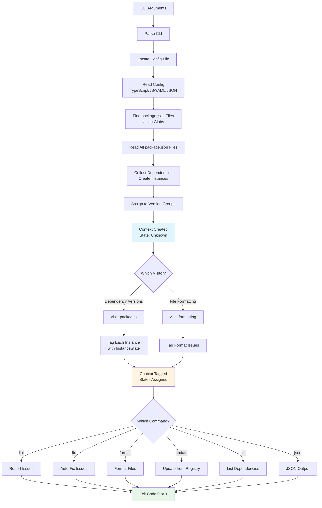

## InstanceState State Machine

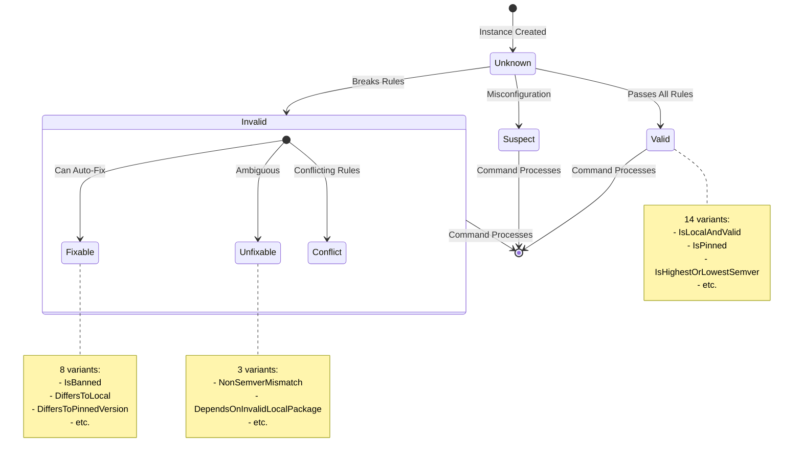

## Context Ownership Flow

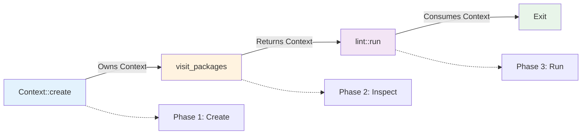

## Version Group Decision Tree

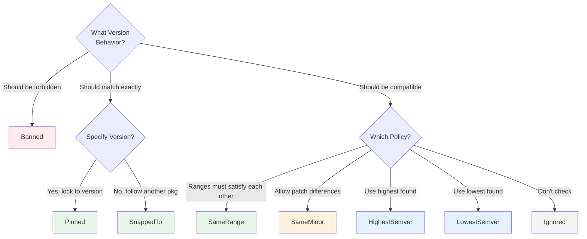

## Test Builder Pattern

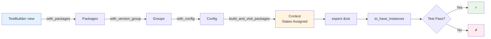

## Visitor Pattern Flow

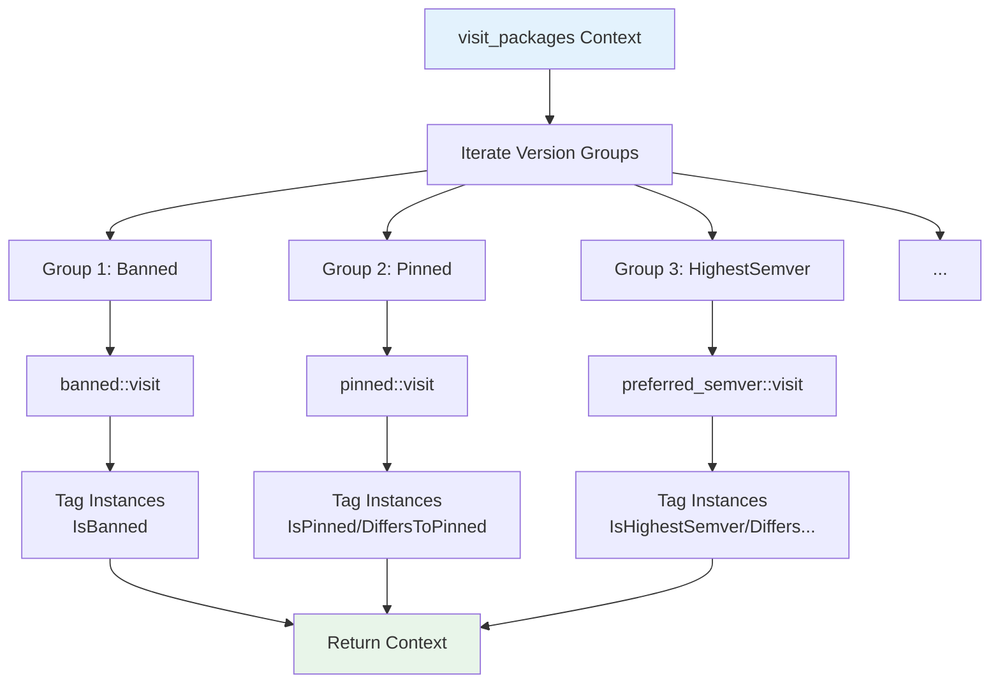

## Command Iteration Pattern

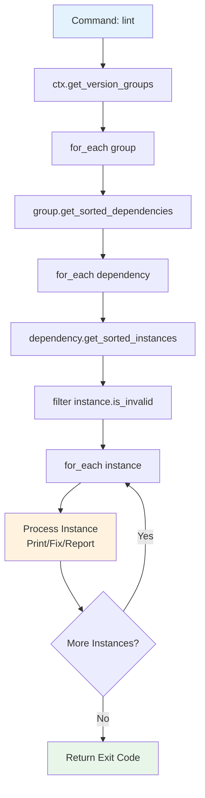

## Specifier Type Hierarchy

```mermaid
graph TD
    Specifier[Specifier Enum]

    Specifier --> BasicSemver[BasicSemver<br/>1.2.3, ^1.2.3, ~1.2.3]
    Specifier --> ComplexSemver[ComplexSemver<br/>>=1.0.0 <2.0.0]
    Specifier --> WorkspaceProto[WorkspaceProtocol<br/>workspace:*, workspace:^]
    Specifier --> Git[Git<br/>git://github.com/...]
    Specifier --> File[File<br/>file:../path]
    Specifier --> URL[Url<br/>http://example.com/...]
    Specifier --> Alias[Alias<br/>npm:pkg@version]
    Specifier --> Tag[Tag<br/>latest, next, beta]
    Specifier --> None[None<br/>missing]
    Specifier --> Unsupported[Unsupported<br/>unrecognized]

    BasicSemver --> Latest[Latest: *]
    BasicSemver --> Major[Major: 1]
    BasicSemver --> Minor[Minor: 1.2]
    BasicSemver --> Patch[Patch: 1.2.3]

    style BasicSemver fill:#e8f5e9
    style ComplexSemver fill:#fff3e0
    style WorkspaceProto fill:#e3f2fd
    style Unsupported fill:#ffebee
```

## File Organization

```mermaid
graph TD
    Root[src/]

    Root --> Core[Core Files]
    Root --> Commands[commands/]
    Root --> VisitPkg[visit_packages/]
    Root --> VisitFmt[visit_formatting/]
    Root --> Test[test/]
    Root --> Other[Other Modules]

    Core --> Main[main.rs<br/>Entry point]
    Core --> CLI[cli.rs<br/>Arg parsing]
    Core --> Context[context.rs<br/>Main struct]
    Core --> Instance[instance.rs<br/>Dependency occurrence]
    Core --> State[instance_state.rs<br/>State machine]

    Commands --> Lint[lint.rs]
    Commands --> Fix[fix.rs]
    Commands --> Format[format.rs]
    Commands --> Update[update.rs]

    VisitPkg --> Banned[banned.rs<br/>banned_test.rs]
    VisitPkg --> Pinned[pinned.rs<br/>pinned_test.rs]
    VisitPkg --> Semver[preferred_semver.rs]

    Test --> Builder[builder.rs<br/>TestBuilder]
    Test --> Expect[expect.rs<br/>Assertions]
    Test --> Mock[mock.rs<br/>Utilities]

    style Main fill:#e3f2fd
    style Context fill:#e3f2fd
    style State fill:#e3f2fd
    style Builder fill:#fff3e0
```

## Adding a New Command - Flow

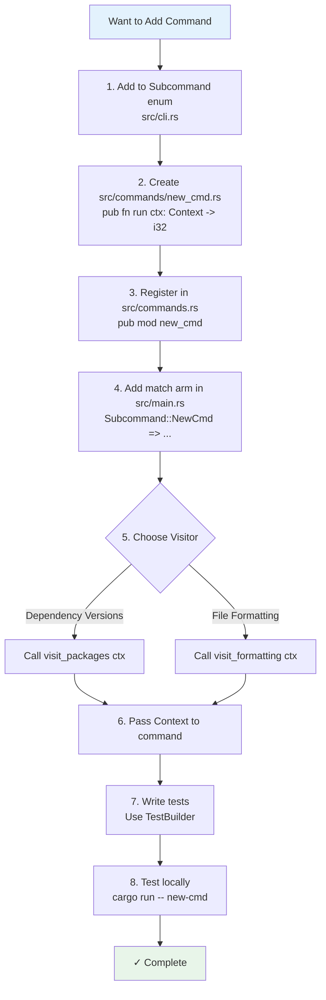

## Version Groups - First Match Wins

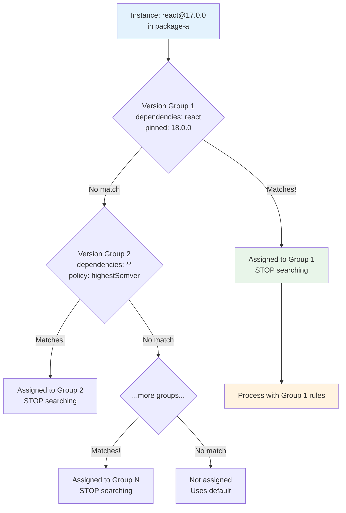

## Context Fields and Relationships

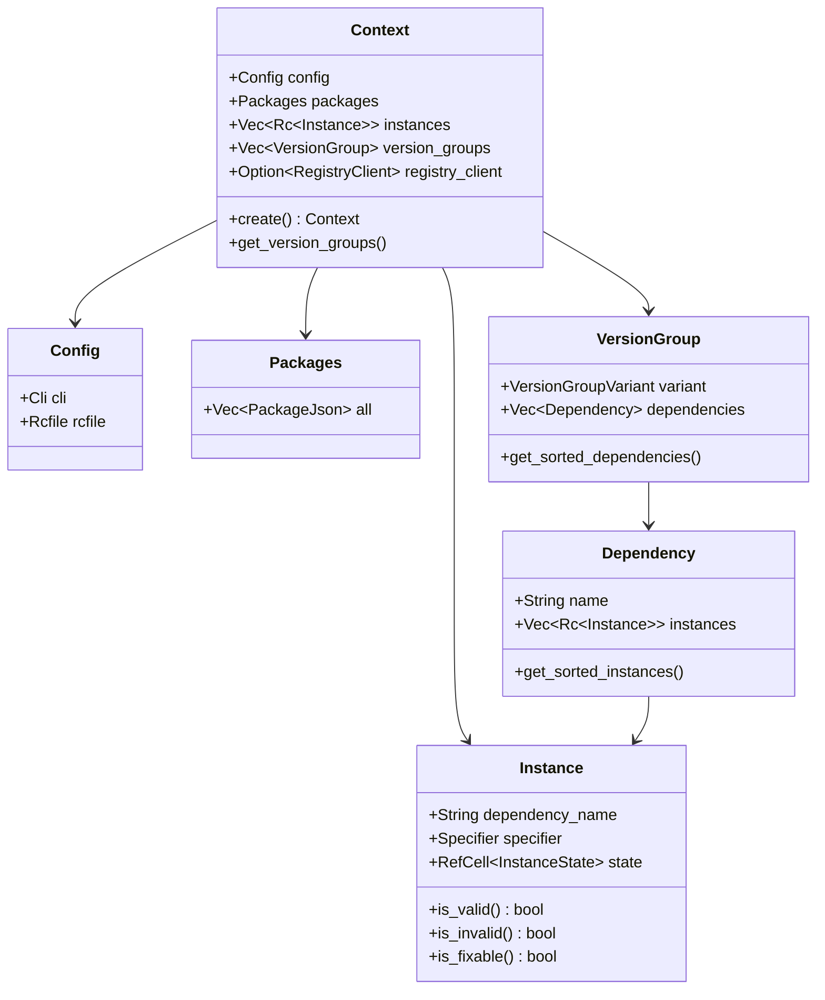

## Understanding These Diagrams

Each diagram serves a specific purpose:

1. **Data Flow** - Shows the complete pipeline from CLI to exit
2. **State Machine** - Shows how instances transition between states
3. **Ownership Flow** - Shows how Context moves through phases
4. **Version Group Decision** - Helps choose the right policy
5. **Test Builder** - Shows the testing workflow
6. **Visitor Pattern** - Shows how validation is organized
7. **Command Iteration** - Shows the standard loop pattern
8. **Specifier Hierarchy** - Shows all version format types
9. **File Organization** - Shows where code lives
10. **Adding Command** - Step-by-step guide
11. **First Match Wins** - Shows how instances are assigned
12. **Context Relationships** - Shows the data structure

## Viewing These Diagrams

These Mermaid diagrams can be viewed in:

- GitHub (renders automatically)
- VS Code with Mermaid extension
- Any Markdown viewer with Mermaid support
- Online at https://mermaid.live/

Copy any diagram into mermaid.live to see it rendered and experiment with modifications.
