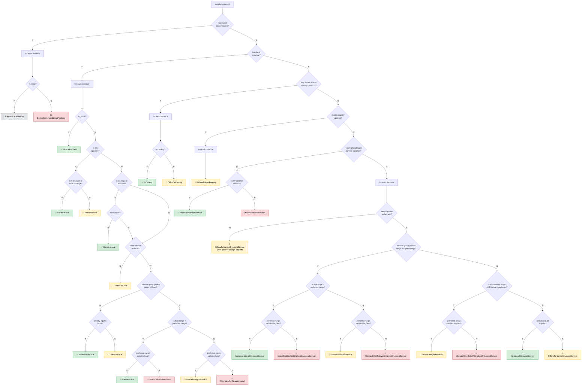

# preferred_semver.rs Decision Tree

## Legend

| Icon | Category  | Meaning                                        |
| ---- | --------- | ---------------------------------------------- |
| ✅   | Valid     | No action needed                               |
| 🔧   | Fixable   | Can be auto-fixed                              |
| 💥   | Conflict  | Semver group and version goal are incompatible |
| ⚠️   | Suspect   | Questionable but not fixable                   |
| ❌   | Unfixable | Error that cannot be auto-fixed                |

## Branch Priority

The top-level branches are evaluated in order — first match wins:

1. **Invalid local** — local package has missing/invalid `.version`
2. **Valid local** — dependency is developed in this monorepo
3. **Catalog** — any instance uses `catalog:` protocol
4. **Registry updates** — npm registry has eligible updates
5. **Highest/lowest semver** — compare against highest (or lowest) version
6. **No semver** — none of the above apply
